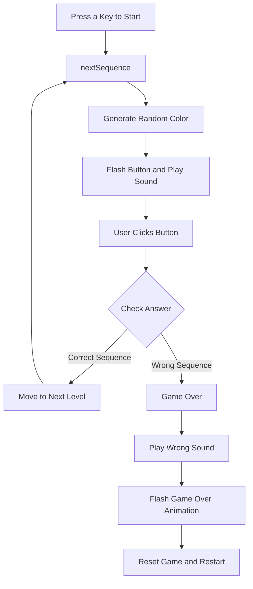
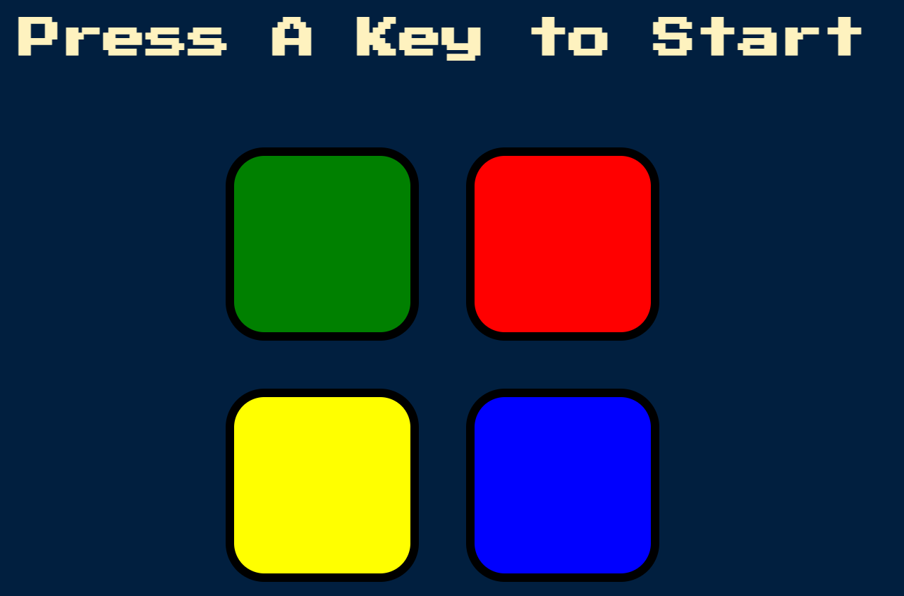

# Simon Game

Welcome to the **Simon Game** project! 🎮 This is a step-by-step guide to help beginners (and curious minds of all ages) build a simple **Simon Game** using JavaScript, jQuery, HTML, and CSS. Follow this guide to learn how to think logically, develop intuition in coding, and create a fun game that tests your memory!

## 🧠 What's the Simon Game?

The **Simon Game** is a memory game where you have to remember and reproduce a sequence of colors. The sequence gets longer each time, and if you mess up, the game is over. Think fast and stay sharp to beat your own high score!

## 💡 What Will You Learn?

- How to create a web-based game using **JavaScript** and **jQuery**.
- How to add animations and sounds to make the game more interactive.
- How to handle user inputs (like clicks and keypresses) with JavaScript.
- How to apply logic to track and verify the user's input against the game pattern.
- How to manage game levels, sequences, and the game-over state.

## 🚀 How to Build the Simon Game

### Step-by-Step Instructions

### 1. **Set Up the Game Structure**

- **Create HTML**: We need an `index.html` file to hold the structure of our game. Here we define the basic elements like the title and buttons for the game.
- **Link Your Styles**: Use a `style.css` file to add color and style to the game.
- **Write the Game Logic**: Use a `game.js` file where all the magic happens. We will write the code for the game logic here.

### 2. **Generate the Color Sequence**

- We use the `nextSequence()` function to randomly pick one of the four colors (red, blue, green, yellow). This is the pattern you will need to follow in the game. Each time you pass a level, the game adds a new color to the sequence.

### 3. **Show the Pattern**

- The game flashes the color buttons one by one to show you the pattern. Each button makes a unique sound so you can remember both the sound and the color.

### 4. **User's Turn to Play**

- Once the pattern is shown, it's your turn to click on the buttons in the correct order. Each time you click, the game checks if you're following the pattern.

### 5. **Check the User's Answer**

- The game compares your sequence to the game's sequence using the `checkAnswer()` function.
  - If you're right, you move to the next level!
  - If you make a mistake, the game ends and shows a "Game Over" message.

### 6. **Handle Game Over and Restart**

- When the user makes a mistake, the game plays a "wrong" sound and shows a flashing effect. You can then restart the game by pressing any key.

---

## 🔥 Simon Game Code Flow (Flowchart)

Here's a simplified flow of how the Simon Game works:



## 🛠 Technologies Used

- **HTML**: Provides the structure for the game (buttons and text).
- **CSS**: Adds colors, animations, and styling to make the game look nice.
- **JavaScript**: Implements the game logic (e.g., generating random sequences, checking the user’s input).
- **jQuery**: Simplifies JavaScript and makes it easier to manipulate the HTML/CSS elements and handle events.

## 📝 How to Run the Game Locally

1. Clone this repository:
    ```bash
    git clone https://github.com/YanneseCode/simon-game.git
    ```

2. Open the project folder and launch `index.html` in your browser.

3. Press a key to start the game and follow the sequence of colors!

4. If you want to make changes to the game, you can edit the `game.js`, `style.css`, or `index.html` files to customize it.

## 📂 Project Structure

```
├── index.html   # Main HTML file
├── styles.css    # CSS for styling the game
└── game.js      # JavaScript file for game logic
```

## 🖼 Preview of the Game



## 🎯 Want to Contribute?

If you'd like to contribute to improving this Simon Game or add new features, feel free to fork this repository and submit a pull request. Let's build this game together!

---

### 🌟 Enjoy the game and have fun coding! 🌟

---

This guide is perfect for anyone who wants to learn how to think about coding logically, make a game, or just play around with JavaScript. Remember, coding is like solving puzzles—try to break things down step by step and have fun while doing it!

---

### 📚 Copyright | Contributor

This project is contributed by **Dr. Angela** via her **Udemy Course** - see the [COURSE](course) link for details.

---

By following this guide, you’re learning how to think like a developer!

---

